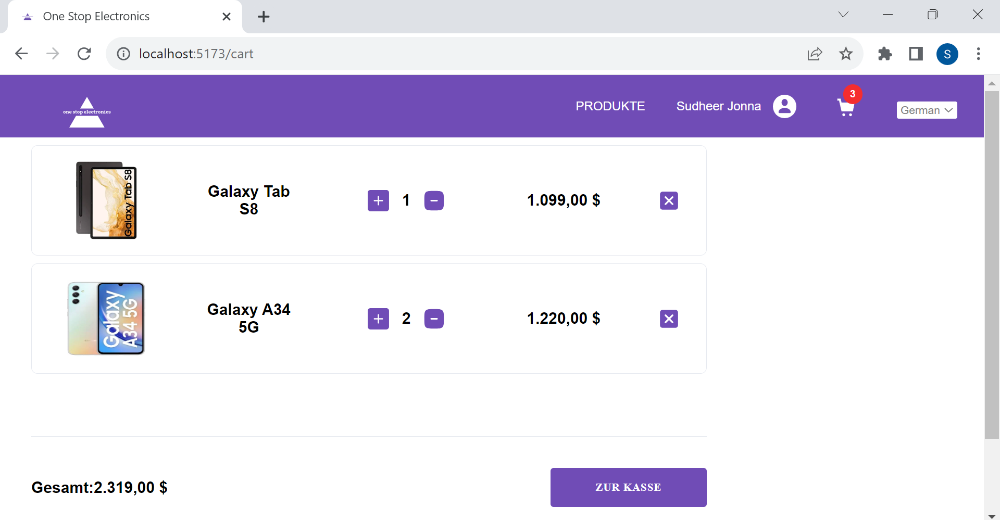

# one-stop-electronics

The demo link is available here: https://onestop-electronics.netlify.app/

## Install and Setup

## Setup firebase project
1. Sign-in firebase console to configure the firebase project here: https://console.firebase.google.com/
2. Ignore google analytics for this project and select authentication and cloudstore firebase services
3. Copy the firebase configuration and store it for creating the firebase instance.

### Environment variable file setup

Create a `.env.local` file and put it in the root folder with the firebase configuration from previous step.

```javascript
VITE_FIREBASE_API_KEY = "yourfirebaseapikey"
VITE_FIREBASE_AUTH_DOMAIN = "yourfirebaseauthdomain"
VITE_FIREBASE_PROJECT_ID = "yourfirebaseprojectid"
VITE_FIREBASE_STORAGE_BUCKET = "yourfirebasestoragebucket"
VITE_FIREBASE_MESSAGING_SENDER_ID = "yourfirebasemessagingsenderid"
VITE_FIREBASE_APP_ID = "yourfirebaseappid"
```

Use the below scripts to run the code, tests and linting

- `dev`/`start` - start dev server and open browser
- `build` - build for production
- `preview` - locally preview production build
- `test` - launch test runner
- `format` - format the code based on prettier
- `lint` - apply eslint for typescript files

## Screens
1. SingUp: 

2. SingIn:

3. Products:

4. Cart:



